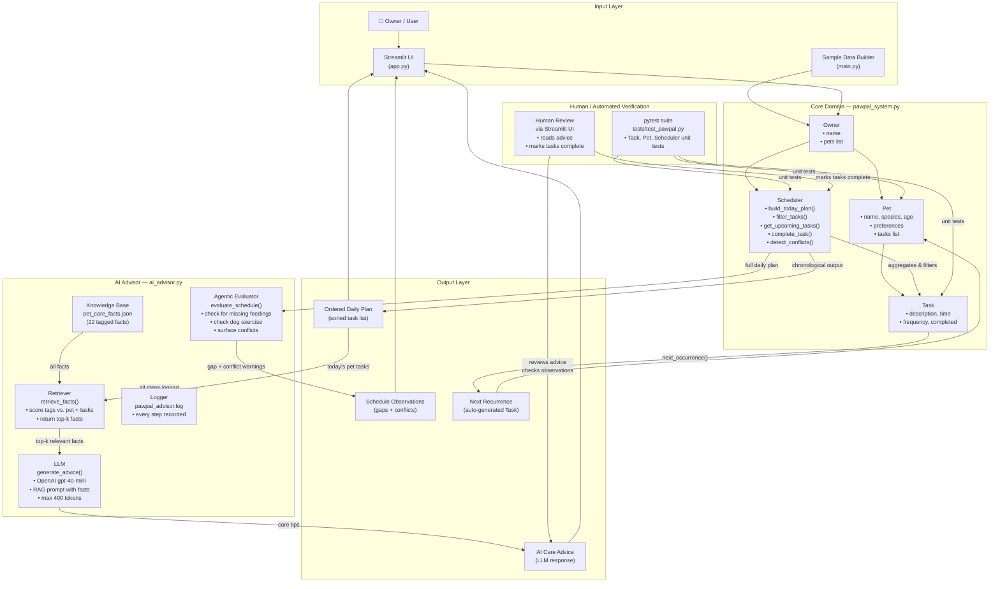

# PawPal+ System Diagram

## Component Summary

| Layer | Component | Role |
|---|---|---|
| Input | `app.py` (Streamlit UI) | Owner enters pets and tasks interactively |
| Input | `main.py` | Seeds sample data for testing/demo |
| Core | `Owner` | Holds pets, aggregates all tasks |
| Core | `Pet` | Holds task list and preferences per pet |
| Core | `Task` | Describes a single care event with time/frequency |
| Core | `Scheduler` | Builds daily plan, filters, handles recurrence, detects conflicts |
| AI | Knowledge Base | 22 tagged, vet-informed pet care facts (JSON) |
| AI | Retriever | Scores and retrieves the most relevant facts for the current pet + tasks (RAG) |
| AI | LLM | Generates personalized care advice grounded in retrieved facts only |
| AI | Agentic Evaluator | Self-checks the schedule for missing feedings, exercise, and time conflicts |
| AI | Logger | Writes every pipeline step to `pawpal_advisor.log` |
| Output | Daily Plan | Sorted, filtered task list for the day |
| Output | AI Care Advice | LLM-generated tips, grounded in retrieved facts |
| Output | Schedule Observations | Warnings about gaps or conflicts found by the evaluator |
| Output | Next Recurrence | Auto-generated follow-up task for repeating items |
| Verification | `tests/test_pawpal.py` | Automated pytest unit tests for core domain |
| Verification | Streamlit UI | Human reads advice, verifies observations, marks tasks complete |
